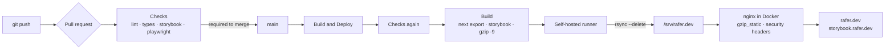

<p align="center">
  <a href="https://rafer.dev/">
    
  </a>
</p>

<h3 align="center">rafer.dev</h3>

<p align="center">
  Portfolio of Rafael Fernandes, product engineer.<br/>
  <em>I solve problems. I build products. Code is just a consequence.</em>
</p>

<div align="center">

[](https://github.com/raferdev/rafer.dev/actions/workflows/deploy.yml)
[](https://github.com/raferdev/rafer.dev/actions/workflows/tests.yml)

[rafer.dev](https://rafer.dev) · [rafer.dev/pt](https://rafer.dev/pt) · [storybook.rafer.dev](https://storybook.rafer.dev)

</div>

---

- [About](#about)
- [What's inside](#whats-inside)
- [Architecture](#architecture)
- [Running locally](#running-locally)
- [Quality gates](#quality-gates)
- [Project layout](#project-layout)
- [Contributing](#contributing)
- [License](#license)

## About

A personal site built the way I build products: small, owned end to end and running in production. It is an editorial, notebook-style page covering experience, open source work, projects, how I work, and the path from physics to production systems.

The site is also a working example of the rest of the delivery chain: a static build, component docs, end-to-end and visual tests, a gated CI/CD pipeline, and a hardened nginx server on hardware I run myself.

## What's inside

- **Bilingual, statically.** English at `/` and Brazilian Portuguese at `/pt`, each with its own root layout and correct `<html lang>`. First-time visitors are sent to their browser's language by a tiny inline script. After that, the language toggle's choice wins.
- **Content as data.** All copy lives in typed modules under `src/config/content`, one per locale, behind a single `SiteContent` type. A missing translation is a type error.
- **Privacy first.** Google Analytics runs in consent mode and stays denied until the visitor accepts. Click tracking is declarative through `data-*` attributes. Bilingual privacy policy (LGPD) at `/privacy` and `/pt/privacidade`.
- **Accessible.** axe-core runs on every page, in both languages, on desktop and mobile.
- **Documented components.** Storybook for the UI building blocks, published at [storybook.rafer.dev](https://storybook.rafer.dev).

## Architecture



- **Build.** Next.js 15 with `output: 'export'` produces plain HTML/CSS/JS. Storybook is built alongside it, and both are pre-compressed so nginx serves `.gz` files directly.
- **Deploy.** A self-hosted GitHub Actions runner on the server pulls the build artifacts and rsyncs only what changed. It rebuilds the nginx image only when `nginx/` changes, then health-checks the live host before finishing. A missing or empty build is refused rather than deployed.
- **Serve.** nginx in a memory-capped container: Content Security Policy, HSTS, and long-lived caching for hashed assets. TLS terminates in front of it.

## Running locally

Requires Node 24 and pnpm 8.14.1.

```bash
pnpm install
```

Analytics env vars are validated at build time. Create `.env.local` with `NEXT_PUBLIC_GA_SRC` and `NEXT_PUBLIC_GA_TAG_ID` (any placeholder works locally).

```bash
pnpm dev
```

The site runs at http://localhost:3000; Portuguese is at `/pt`.

```bash
pnpm dev.storybook
```

Storybook runs at http://localhost:6006.

To test the real static export behind the same nginx config used in production, build it and run Playwright. The config starts the nginx test container on port 3000 via Docker Compose.

```bash
pnpm build
```

```bash
pnpm test.playwright
```

## Quality gates

Every pull request to `main` runs the **Checks** workflow, and the same workflow runs again before every deploy.

| Job       | What it runs                                                                                                                                  |
| --------- | --------------------------------------------------------------------------------------------------------------------------------------------- |
| Lint      | ESLint (flat config) and `tsc --noEmit`                                                                                                       |
| Storybook | A full Storybook build                                                                                                                        |
| Test      | Playwright on desktop and mobile Chrome: sections, i18n, links, analytics consent, privacy pages, axe accessibility and full-page screenshots |

Lint, Storybook and Test are required status checks on `main`, alongside CodeQL. Screenshot baselines are generated on CI so the rendering environment always matches. After an intentional visual change, run the Checks workflow manually with `update_snapshots` and commit the uploaded baselines.

Locally, Husky runs ESLint and Prettier on staged files, and Commitizen guides conventional commit messages.

## Project layout

```
src/
  app/
    (en)/ (pt)/        root layouts and pages per locale
    _layout/           shell: header, footer, consent banner, analytics, metadata
    _page/             home page sections
  components/          shared UI (annotations, scribbles, mockups, policy)
  config/
    content/           typed copy per locale
    i18n.ts            locales, routes and the language redirect
    site.ts            links and site metadata
  lib/                 analytics, consent, fonts
  stories/             Storybook stories
tests/                 Playwright specs and screenshot baselines
nginx/                 production and test nginx images
scripts/deploy.sh      the deploy step run on the server
```

## Contributing

Spotted a bug, a typo, or a security issue? Open an issue. For code, fork from `development` and open a pull request to `main`.

## License

[CC0 1.0](./LICENSE). The code is free to reuse. The written content and personal details describe me, so please don't present them as yours.
